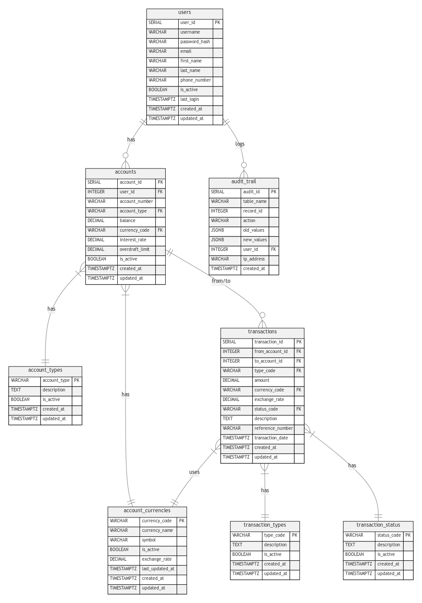

# Wallet System



## Overview
A digital wallet system built with Go and PostgreSQL for managing user accounts and transactions.

## Features
- User account management
- Wallet creation and management
- Secure transaction processing
- Multiple currency support
- Transaction history tracking

## Tech Stack
- Go
- PostgreSQL
- SQLC
- Make
- Docker

### Prerequisites
- Go (1.19 or higher)
- Docker
- Make

### Quick Start

1. Start PostgreSQL container:
```bash
make postgres
```

2. Create database:
```bash
make createdb
```

3. Run migrations:
```bash
make migrate_up
```

4. Generate SQLC code:
```bash
make generate_sqlc
```

5. Run tests:
```bash
make run_test
```

### Available Make Commands
```bash
# Database Management
make postgres          # Start PostgreSQL container
make get_postgres      # Connect to PostgreSQL container
make createdb          # Create database
make get_db           # Connect to database
make dropdb           # Drop database

# Migration Commands
make create_migration  # Create new migration file
make migrate_up       # Run migrations up
make migrate_down     # Run migrations down

# SQLC Commands
make pull_sqlc        # Pull SQLC Docker image
make init_sqlc        # Initialize SQLC
make generate_sqlc    # Generate SQLC code

# Testing
make run_test         # Run tests with coverage
make clean_test_cache # Clean test cache
```